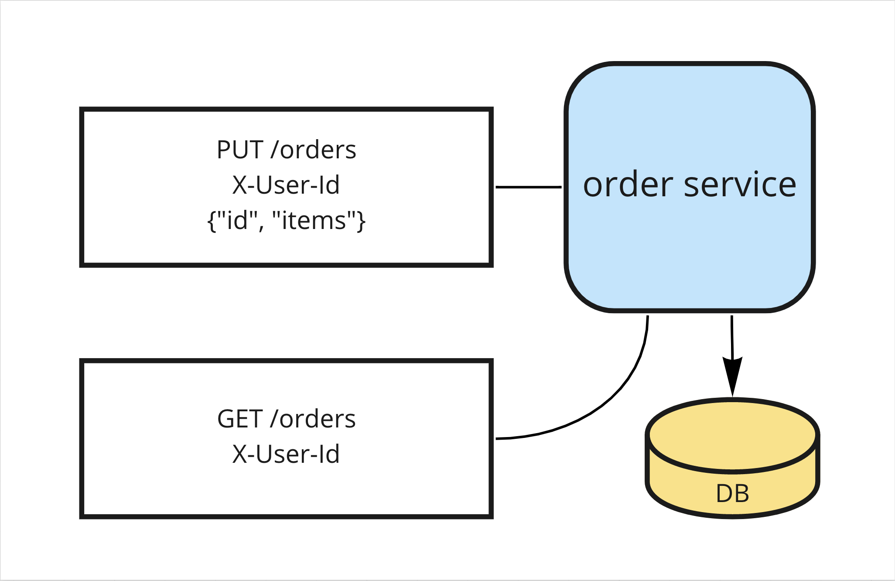

= Домашнее задание к лекции "Идемпотетность и коммутативность API в HTTP и очередях"

== Текст задания

Создайте сервис "Заказ" (или используйте сервис из прошлого занятия) и для одного из его методов, например,
"создание заказа" сделать идемпотетным.

На выходе должно быть:

. Описание того, какой паттерн для реализации идемпотентности использовался.
. Команда установки приложения (из helm-а или из манифестов). Обязательно указать в каком namespace нужно устанавливать и команду создания namespace, если это важно для сервиса.
. Тесты в Postman. В тестах обязательно использование домена arch.homework в качестве initial значения {{baseUrl}}.

== Проверка задания

=== Архитектурное решение

Идемпотентность эндпоинта PUT /orders достигается за счет естественного ключа идемпотентности. В качестве него используется поле id из заказа. Генерация значения данного поля возлагается на клиента.

=== Сборка приложения

[source,bash]
----
./mvnw package
----

=== Деплой образа

[source,bash]
----
docker login
docker push nao4j/idempotency-order-service:3.0.0
----

=== Запуск Minikube

[source,bash]
----
minikube start --driver=virtualbox
----

=== Активация Ingress аддона

[source,bash]
----
minikube addons enable ingress
----

=== Создание пространства имен

[source,bash]
----
kubectl create namespace myapp
kubectl config set-context --current --namespace=myapp
----

=== Установка зависимостей

[source,bash]
----
helm dependency update ./idempotency-order-service-chart
----

=== Установка Helm-чарта

[source,bash]
----
helm install idempotency-order-service-chart ./idempotency-order-service-chart
----

=== Проверка работоспособности

[source,bash]
----
newman run idempotency-order-service.postman_collection.json
----
