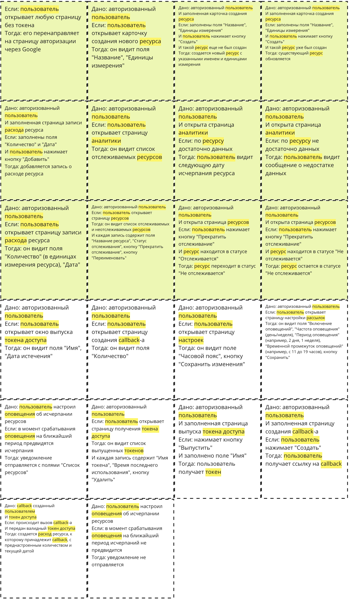
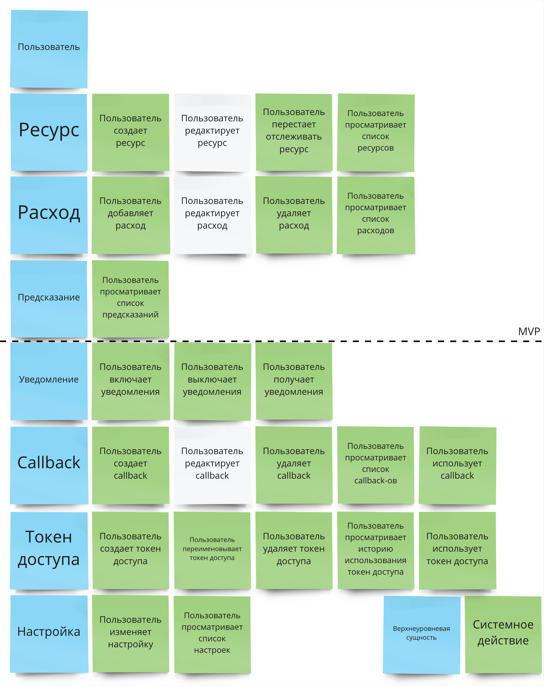
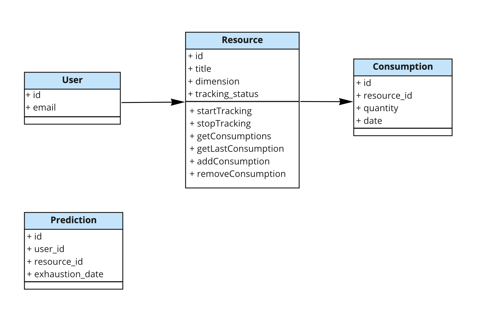
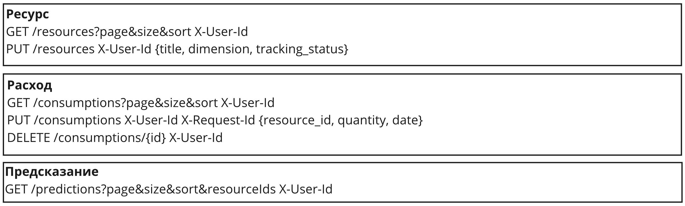
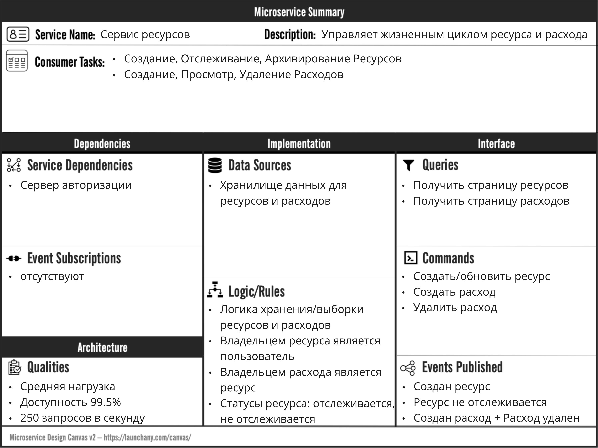
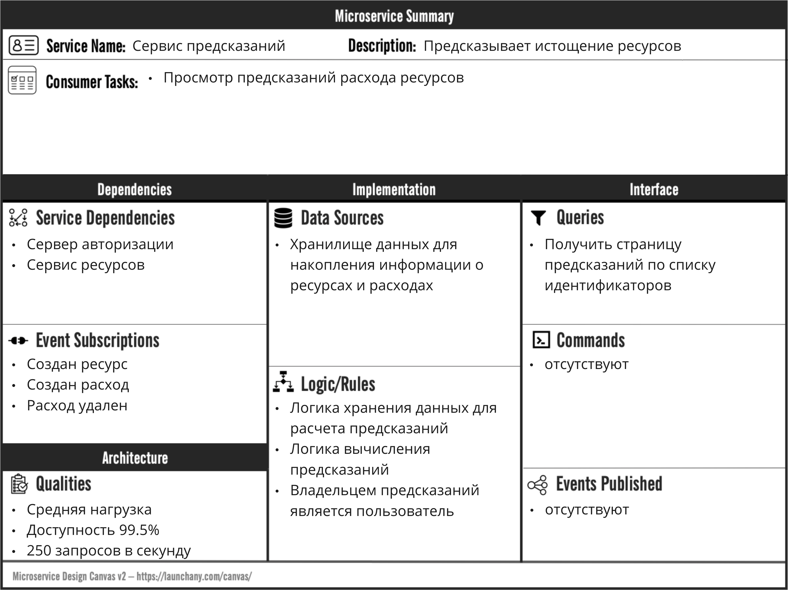
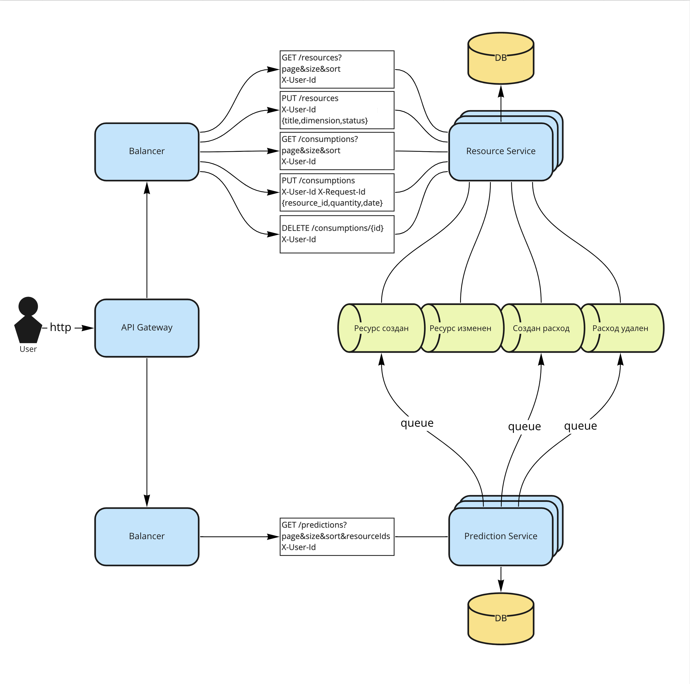

= Домашнее задание к лекции "Паттерны декомпозиции микросервисов"

== Текст задания

Разделите ваше приложение на несколько микросервисов с учетом будущих изменений.

Попробуйте сделать несколько вариантов разбиений и попробуйте их оценить. Выберите вариант, который вы будете реализовывать.

На выходе вы должны предоставить:

* Пользовательские сценарии
* Общую схему взаимодействия сервисов
* Для каждого сервиса опишите назначение сервиса и его зону ответственности
* Опишите контракты взаимодействия сервисов друг с другом

== Описание системы

Трекер исчерпания ресурсов.

Данная система должна позволять вести учет исчерпания различных ресурсов и предоставлять прогнозы следующей даты исчерпания.

В полнофункциональной версии у пользователя должна быть возможность создавать callback-ссылки для записи расхода по каждому из ресурсов. Чтобы использовать их с устройствами IoT или любыми другими удобными интерфейсами ввода. И должна быть возможность настроить уведомления с прогнозом исчерпания ресурсов на почту.

== Пример применения

Пользователь заводит в системе, часто используемые им, бытовые расходники. Например: стиральный парашек, мыло, шампунь, сахар, соль, масло, чай, кофе.

Пользователь отмечает даты исчерпания и количество каждого ресурса по мере их истощения.

Система анализирует частоту и объемы расходов и составляет прогноз следующей даты исчерпания каждого из отслеживаемых ресурсов.

== BDD-сценарии

* зеленым отмечены сценарии, вошедшие в MVP

== Верхнеуровневые сущности и системные действия

== Модель предметной области v0

== API v0

== Описание сервисов

== Схема взаимодействия сервисов

